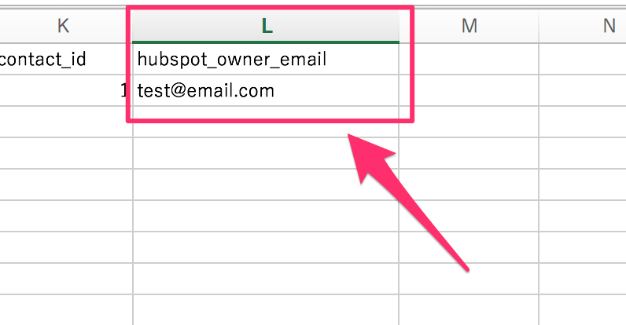

# HubSpot CRM Importer

HubSpot offers a functionality of importing CRM data from CSV files. You can import contacts, companies, and deals by using it. However, it has one big limitation — you can not associate those objects when importing data. This is where HubSpot CRM Importer script shines. This script imports data from CSV files into your HubSpot portal with beautiful relationships. :)

## Requirements

- Python 3+

The following articles might helpful to install Python 3+ if you have not installed.

- [Installing Python 3 on Mac OS X](http://docs.python-guide.org/en/latest/starting/install3/osx/)
- [How to Install Python on Windows](https://www.howtogeek.com/197947/how-to-install-python-on-windows/)

*If you’re using Python 2.7.9 (or greater) or Python 3.4 (or greater), then PIP comes installed with Python by default.*

## Getting Started

1.Clone the repository.

    $ git clone https://github.com/shinobukawano/hubspot-crm-importer

2.Install [Requests](http://docs.python-requests.org/en/master/) library.

    $ pip install requests

3.Add your HubSpot API Key in `main.py`, line 15.

    API_KEY = '246b....'

## Example

You can run this script with [sample import files from HubSpot Academy](https://knowledge.hubspot.com/articles/kcs_article/contacts/sample-import-files).

Open your terminal, and execute `python main.py` command. It loads those files from `csv` directory and creates contacts, companies, and deals data into your HubSpot portal.

## How does the script relate objects?

`company_id` and `contact_id` columns in csv files is the secret of it. The script associates objects based on values of them.

You can also set the owner of objects using `hubspot_owner_email` column. It finds HubSpot user by given email address and assign it to objects.

## Applying the script in the real environment

I assume you will need to edit some portion of the script to meet your real environment. You may want to add properties of objects or modify column names of CSV files, etc. Feel free to adjust the script. I hope this script become a good starting point for your migration.

## Troubleshooting

If the script does not work properly, please confirm `import.log` which will be generated in the root directory of the project. You may find information about the issue.

## License

This software is licensed under the MIT License.
